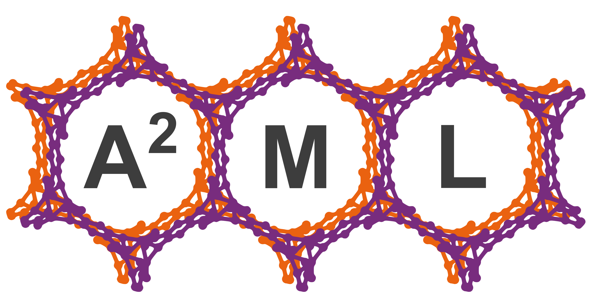

# bioMOFx: A High-Throughput Approach to Screen Large MOF Libraries for Biocompatibility.  

This is the official implementation for our upcoming paper (under revision):
### Guiding the rational design of biocompatible metal-organic frameworks for drug delivery using machine learning.
[Dhruv Menon](https://scholar.google.com/citations?user=NMOjZLQAAAAJ&hl=en&oi=ao)\,
[David Fairen-Jimenez](https://scholar.google.com/citations?user=F3UKbZsAAAAJ&hl=en&oi=ao)\*

For correspondence please contact: dm958[at]cam[dot]ac[dot]uk or df334[at]cam[dot]ac[dot]uk.

The python code in this repository is capable of executing the pipeline as illustrated below.  
<p align="center">
  
</p>  

Here, we provide a walk-through of the code. It would be best to execute these in a dedicated environment.   
```
conda create -y -n biomofx python=3.10
conda activate biomofx
```
* data_featurize.py: Featurization of the data to produce 197 descriptors capturing the information of the molecule at various lengthscales.
  You need to have 'rdkit' installed which you can install with:
  ```
  pip install rdkit
  ```
  or
  ```
  conda install -c conda-forge rdkit
  ```
  For a list of SMILES, generate features by adding the following lines of code to the script:
  ```python
  smiles_list = [] # add here the SMILES string from the data
  features = feature_generate(smiles_list) # returns the feature dataframe that can be used for model training
  ```
* generate_features.py: This code is used to pass a dataset of molecules through data_featurize to generate a CSV file of featurized data.  
* data_sampling.py: Sampling of the data to ensure balanced classes. Majority class is undersampled (random sampling) and the minority class is oversampled (ADASYN algorithm).
  You need to have the imbalanced-learn package installed, which you can install with:
  ```
  pip install imbalanced-learn
  ```
  Here operating inside an environment helps, in order to avoid the 'dependency hell'. However, just in case, you may check the dependencies here: [https://imbalanced-learn.org/stable/install.html]
  For undersampling, we recommend using random undersampling. Here, be sure to define the sampling strategy as follows:
  ```python
  strategy = {-1: 0, 0: 5000, 1: 0}
  '''
  0 being the majority class is being undersampled to 5000 points, while -1 and 1 being the minority classes are not undersampled.
  '''
  ```
  For undersampling/oversampling, simply call the respective functions:
  ```python
  X_sampled, y_sampled = undersample_random(X, y) # for undersampling
  X_sampled, y_sampled = oversample_ADASYN(X, y) # for oversampling
  ```
* feature_selection.py: Selecting the KBest features (outlined in the manuscript) as implemented using scikit-learn, which can be installed using:
  ```
  pip install scikit-learn
  ```
  If you are directly running this script, please provide the path to the featurized data and the number of features to be selected as:
  ```python
  path = 'data.csv' # add your path here
  K = 110 # number of features to be selected (best performance reported for 110 features using the i.p. data - please refer to manuscript)
  ```
  Run as follows (will save the data as a csv file):
  ```python
  _ = run(path, K)
  ```
* gbt_coarsegrid.py: The Gradient Boosting Machine (GBM) trained on a coarse-grid of hyperparameters as outlined in the manuscript and the schematic above. The model has been implemented using scikit-learn.
  Now, depending on the computational resources at your disposal, you may consider making the parameter space larger or smaller.
  ```python
  param_grid = {'learning_rate : [0.1, 0.01, 0.001],
                'max_iter' : [100, 200, 300, 400, 500],
                'max_leaf_nodes' : [10, 20, 30, 40, 50, 60, 70, 80, 90, 100],
                'min_samples_leaf' : [20, 30, 40, 50, 60, 70, 80, 90, 100],
                'l2_regularization' : [0, 0.5, 0.75, 1, 10]}
  ```
  Depending on the feature-set, with the parameter space outlined above, this could take anywhere between a couple of hours, to over 12 hours to execute. To run the code, simply execute:
  ```python
  path = 'data.csv' # path to the data
  scores = run_model(path) # returns the model performance
  ```
* rfc_coarsegrid.py: The RF trained on a coarse-grid of hyperparameters as outlined in the manuscript and the schematic above. The model has been implemented using scikit-learn.
  The parameter space we have defined is as follows:
  ```python
  param_grid = {'n_estimators' : [100, 200, 300, 400, 500, 600, 700, 800, 900, 1000],
                'max_depth' : [10, 20, 30, 40, 50, 60, 70, 80, 90, 100],
                'min_samples_split' : [2, 5, 10]}
  ```
  You can expect similar timescales - based on the size of the dataset you are training the models on.
* svc_coarsegrid.py: The Support Vector Machine (SVM) trained on a coarse-grid of hyperparameters as outlined in the manuscript and the schematic above. The model has been implemented using scikit-learn.
  The parameter space we have defined is as follows:
  ```python
  param_grid = {'C' : [0.1, 1, 5, 10],
                'kernel' : ['linear', 'poly', 'rbf', 'sigmoid'],
                'decision_function_shape' : ['ovo', 'ovr']}
  ```
* rfc_finegrid.py: The RF trained on a fine grid of hyperparameters as outlined in the manuscript and the schematic above. The model has been implemented using scikit-learn.
* rfc.py: Training the best performing model - the random forest (RF) using the optimum hyperparameters as deduced from the coarsegrid and finegrid hyperparameter optimization processes. The best performing model is saved after this code is executed.
  To run the model:
  ```python
  path = 'data.csv' # path to where the data is stored
  _, _, model, _, _, _, _, _, _, _, _ = run_model(path) 
  ```
  This will save the trained model for future use as finalized_model.sav (~200 Mb)
* prediction_HTS.py: Predict the toxicity of MOF linker molecules in a high-throughput manner.
  You would need to have a saved model to execute this code. To run, you need a csv file with the list of linkers to be tested.
  Add the path to where the list is saved as:
  ```python
  data_path = 'data.csv'
  ```
  Add the path to where the model is saved as:
  ```python
  model_path = 'finalized_model.sav'
  ```
In order to fragment MOF structures into their building MOFs, we recommend using *moffragmentor*, developed by Jablonka et al. 
The code for the fragmentation of a MOF into its building blocks (moffragmentor) has been developed by Jablonka et al. If you are using this code, please cite: Jablonka, K.M., Rosen, A.S., Krishnapriyan, A.S. and Smit, B., 2023. An ecosystem for digital reticular chemistry.

Here we provide an overview of the part of the code we developed to leverage moffragmentor in a high-throughput manner.
* mof_parser.py: The crystallographic information file (CIF) of the MOFs as extracted from the CSD need to be re-prased due to some occupancy issues. This code is capable of doing so in a high-throughput manner.
* fragmentor.py: Carries out MOF fragmentation in a high-throughput manner. Ideally saves the CSV file with the name of the MOF (CSD refcode), metallic node and linker. However, in case of an issue, it also prints a text file with all the details.

In addition to this, we provide a list of CIF files of Zr-centered MOFs (as a test case) which have been parsed, and the list of these MOFs that have been identified to be safe. 

## Getting Started
The code provided is readily implementable - the only change required is putting in the correct path to the directory where the data is stored. If you want to train the models yourself, follow these steps:
1. Featurize the data: For this, use generate_features.py.
2. Sample the data: For this, use data_sampling.py
3. Select the 'K'-best features: For this, use feature_selection.py
4. Model training (coarse-grid): Train the model on the features selected on a coarse-grid of hyperparameters. While you can use rf_coarsegrid.py, gbt_coarsegrid.py or svc_coarsegrid.py, we recommend you use either the rf_coarsegrid.py or gbt_coarsegrid.py.
5. Model training (fine-grid): Train the model on a finer grid (based on the outcome of the coarse-grid optimization). In case you are using a GBM, make appropriate changes to rfc_finegrid.py, else leave it as is. This should give you the hyperparameters with the best performance.
6. Final Model training and saving: For this, use rfc.py - with the hyperparameters as outputted in the fine-grid optimization. This code will save a model which can be used for future predictions.
7. MOF fragmentation: First, place all the CIF files in a directory and run mof_parser.py. This will save parsed CIF files into a new directory. Then run fragmentor.py. This will save a CSV file with the list of nodes and linkers.
8. High-throughput screening: For this, use prediction_HTS.py.

Alternatively, if you have less expertise in code, and simply want to use the model to quickly identify the potential toxicity of linkers you are interested in - you can download and use the Jupyter Notebook provided. The ZIP file also contains the dataset on which the best performing model was trained on. 

## Contributing
Contributions, whether filing an issue, making a pull request, or forking, are appreciated. 

## License
This code package is licensed under the MIT License. 

## Development and Funding
This work was carried out at the Adsorption and Advanced Materials (A2ML) Laboratory. Supported by the Engineering and Physical Sciences Research Council (EPSRC) and the Trinity Henry-Barlow (Honorary) Scholarship. 
<p align="center">
  
</p>  

